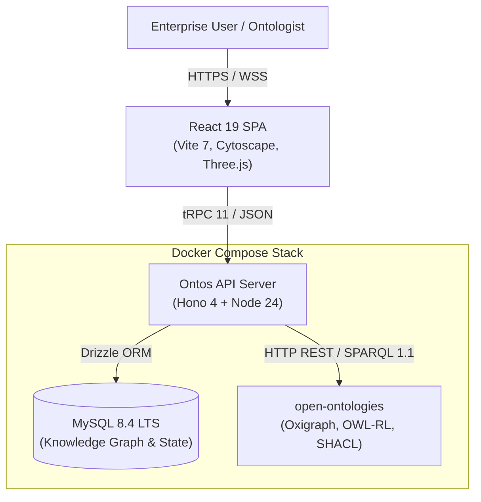

# Ontos

[](https://github.com/piercepartners/ontos-digital-twin/actions/workflows/ci.yml)
[](LICENSE)
[](https://www.typescriptlang.org/)
[](https://react.dev/)
[](https://hono.dev/)
[](app/vitest.config.ts)
[](compose.yaml)

An enterprise ontology management and digital twin platform. Ontos models five business
domains — HR, Legal, Compliance, Finance, Logistics — plus a DTDL-compatible Digital Twin
layer, and unifies them into a single governed knowledge graph with deterministic anomaly
detection, a hash-linked audit chain, and native RDF/OWL semantics.

It ships with a fully seeded demo workspace (Acme Corp) containing ~3,600 graph nodes and
~7,700 edges, including deliberately planted anomalies for the insight engine to surface.

---

## 🤖 Built with AI-Assisted Agents

Ontos is a centerpiece system engineered using multi-agent AI coding swarms directed by **Senan Sumrein**. It demonstrates how AI-assisted agent swarms can plan, execute, decouple proprietary vendor lock-in, harden security to OWASP standards, and verify complex distributed architectures.

- 📖 **[AI Agent Architecture Case Study (AI_AGENT_ARCHITECTURE.md)](AI_AGENT_ARCHITECTURE.md)** — Detailed whitepaper on the multi-agent workflow, agent roles, adversarial review, and verification discipline.

---

## Capabilities

- **Ontology Studio** — browse, extend, version and diff ontology modules; Cytoscape.js
  class graph, Turtle export, SHACL shape authoring.
- **Knowledge Graph Explorer** — interactive graph traversal with cross-module edges.
- **Native semantics** — OWL-RL reasoning, W3C SHACL validation and SPARQL 1.1 over an
  Oxigraph triple store (see [Semantic engine](#semantic-engine)).
- **Explainable SHACL** — violations are returned with a justification tree, a canonical
  signature, a human-readable explanation and a remediation action.
- **Insight engine** — 12 deterministic anomaly rules over the graph (no LLM involved).
- **Digital twins** — twin registry, live telemetry time series, topology subgraphs, and
  Azure DTDL v3 JSON export.
- **Data mapping** — CSV → ontology class/property mapping with pre-commit SHACL checks.
- **Natural language query** — pattern-based, ontology-grounded NL → SQL translation that
  always shows the generated query and refuses write or unsafe intents.
- **RBAC + audit** — five roles, per-route authorization, SHA-256 hash-linked audit log.

---

## Architecture



| Layer | Technology |
|---|---|
| Frontend | React 19, Vite 7, TypeScript 5.9, Tailwind CSS 3.4, Radix UI |
| Visualization | Cytoscape.js, Recharts, Three.js / react-three-fiber |
| API | Hono 4 (HTTP), tRPC 11 (type-safe RPC), SuperJSON |
| Database | MySQL 8, Drizzle ORM 0.45 |
| Semantics | open-ontologies — Oxigraph store, OWL-RL reasoner, SHACL validator |
| Auth | Self-contained HS256 JWT (`jose`), scrypt password hashing |
| Build | Vite (client) + esbuild (server bundle) |
| Tests | Vitest (45/45 tests passing) |

In development, Vite serves the SPA and mounts the Hono app at `/api/*` through
`@hono/vite-dev-server` — a single process on port 3000. In production, `dist/boot.js`
serves both the API and the static client bundle.

---

## Quick start

### With Docker — recommended

Needs only Docker. Brings up MySQL, the semantic engine, and the app.

```bash
cp .env.example .env      # fill in the four secrets: openssl rand -hex 32
docker compose up --build
```

Open http://localhost:3000 and sign in as `ADMIN_EMAIL` with `ADMIN_PASSWORD`.

The first boot takes about twenty seconds: a one-shot `init` service applies the SQL
migrations, seeds the Acme Corp demo workspace, and creates the admin account. Later boots
apply any new migrations and leave your data alone — the seed runs only against an empty
database. To wipe everything and start over:

```bash
docker compose down -v    # -v deletes the database volume
```

### Local development

Needs **Node.js 20+** (developed against 24.x), **MySQL 8+**, and optionally the
[semantic engine](#semantic-engine) binary.

```bash
cd app
npm install
cp .env.example .env      # APP_SECRET and DATABASE_URL are required

npm run build:db          # bundle the bootstrap and seed scripts
npm run db:bootstrap      # migrate, seed on first run, provision the admin account
npm run dev               # http://localhost:3000
```

`db:bootstrap` is the same job the Docker `init` service runs, so both paths build the
database identically.

### Signing in

In development, the login screen offers four one-click demo personas, created on first use:

| Role | Persona | Email |
|---|---|---|
| `admin` | Elena Cortez | admin@acme-ontology.com |
| `ontologist` | Dr. James Wei | ontologist@acme-ontology.com |
| `editor` | Priya Sharma | editor@acme-ontology.com |
| `viewer` | Alex Morgan | viewer@acme-ontology.com |

**Production disables persona login**, which is why the Docker stack provisions a real
admin account instead. To re-enable personas for a local demo, set `ALLOW_DEMO_LOGIN=true` —
but understand that anyone who can reach the server can then sign in as any role, admin
included, without a password. The server logs a warning at startup whenever it is on.

---

## Environment variables

### Docker

The root `.env` (from the root `.env.example`) feeds `compose.yaml`. The four secrets are
required; `docker compose` refuses to start without them.

| Variable | Required | Purpose |
|---|---|---|
| `APP_SECRET` | **yes** | Signs session tokens. 32+ random characters. |
| `MYSQL_PASSWORD` | **yes** | Password for the `ontos` database user. Use hex — it is embedded in a URL. |
| `MYSQL_ROOT_PASSWORD` | **yes** | MySQL root password. |
| `ADMIN_PASSWORD` | **yes** | Password for the admin account. Re-applied on every start, so changing it and restarting rotates it. |
| `ADMIN_EMAIL` | no | Admin account address. Default `admin@acme-ontology.com`. |
| `ONTOS_PORT` | no | Host port for the app. Default `3000`. |
| `ALLOW_DEMO_LOGIN` | no | `true` re-enables persona login. Local demos only — see [Signing in](#signing-in). |
| `ALLOWED_ORIGINS` | no | Cross-origin allowlist. The bundled client is same-origin and needs nothing here. |

### Application

`app/.env` (from `app/.env.example`) configures the server directly. Only `APP_SECRET` and
`DATABASE_URL` have no usable default.

| Variable | Required | Default | Purpose |
|---|---|---|---|
| `APP_SECRET` | **yes** | — | HS256 signing key for session JWTs. Use 32+ random chars. |
| `DATABASE_URL` | **yes** | — | MySQL connection string, e.g. `mysql://root:@localhost:3306/ontos` |
| `APP_ID` | no | `ontos` | Application identifier |
| `ADMIN_EMAIL` | no | `admin@acme-ontology.com` | This address is auto-promoted to the `admin` role |
| `ADMIN_PASSWORD` | no | — | When set, `db:bootstrap` provisions the admin account with it (12+ chars) |
| `ALLOW_DEMO_LOGIN` | no | `false` | `true` re-enables persona login in production |
| `PORT` | no | `3000` | Production HTTP port |
| `NODE_ENV` | no | — | `production` enables static serving, strict cookies, and required-secret checks |
| `ALLOWED_ORIGINS` | no | — | Comma-separated CORS/CSRF allowlist for **cross-origin** callers. Production rejects any cross-origin request not listed; same-origin use is unaffected. |
| `MIGRATIONS_DIR` | no | `./db/migrations` | Where `db:bootstrap` finds SQL migrations |
| `OPEN_ONTOLOGIES_URL` | no | `http://127.0.0.1:8085` | Semantic engine base URL |
| `OPEN_ONTOLOGIES_PORT` | no | `8085` | Port used when auto-starting the engine |
| `OPEN_ONTOLOGIES_TOKEN` | no | — | Bearer token, if the engine requires one |
| `OPEN_ONTOLOGIES_BIN` | no | — | Explicit path to the engine binary |
| `VITE_APP_ID` | no | — | Application identifier exposed to the browser |

---

## Semantic engine

Reasoning, SHACL validation and SPARQL are delegated to
[open-ontologies](https://github.com/fabio-rovai/open-ontologies) (MIT), a standalone Rust
binary that runs an in-memory Oxigraph triple store behind an HTTP API. Ontos is tested
against **v1.3.0**.

**With Docker** there is nothing to install. The `engine` service runs the official image,
`ghcr.io/fabio-rovai/open-ontologies:1.3.0`, pinned by digest, as a non-root user on a
read-only filesystem.

**For local development**, download the v1.3.0 binary for your platform from the
[release page](https://github.com/fabio-rovai/open-ontologies/releases/tag/v1.3.0) — Linux
x86_64, macOS (Intel and Apple Silicon) and Windows are published — and verify it against
the release's `SHASUMS.txt`. Binaries are gitignored, so place it at either:

```
bin/open-ontologies          # repo root  (bin/open-ontologies.exe on Windows)
app/bin/open-ontologies
```

or point `OPEN_ONTOLOGIES_BIN` at it. The server resolves these paths at startup and
spawns the daemon on demand, detached, so it outlives the process that started it:

```bash
open-ontologies daemon start --host 127.0.0.1 --port 8085
open-ontologies daemon status
open-ontologies daemon stop
```

Engine state is confirmed by the health endpoint:

```bash
curl http://localhost:3000/api/health
# {"status":"ok","database":"connected","semanticEngine":{"status":"connected","version":"1.3.0",...}}
```

**Without the engine**, the app still runs. Reasoning falls back to a deterministic
in-process subclass walker, and SHACL validation is skipped — see
[Known limitations](#known-limitations) for how that is reported.

---

## Scripts

Run from `app/`.

| Command | Description |
|---|---|
| `npm run dev` | Vite dev server + API on port 3000 |
| `npm run build` | Production build → `dist/public` (client) and `dist/boot.js` (server) |
| `npm run build:db` | Bundle the bootstrap and seed scripts → `dist/db/` |
| `npm run db:bootstrap` | Migrate, seed an empty database, provision the admin account |
| `npm start` | Serve the production build |
| `npm run check` | TypeScript project build (`tsc -b`) |
| `npm run lint` | ESLint |
| `npm run format` | Prettier |
| `npm test` | Vitest suite |
| `npm run db:generate` | Generate a SQL migration into `db/migrations` after a schema change |
| `npm run db:migrate` | Apply pending migrations with drizzle-kit |
| `npm run db:push` | Push the schema straight to MySQL, bypassing migrations — prototyping only |

`npm start` is written for a POSIX shell. On Windows, run the equivalent directly:

```powershell
$env:NODE_ENV = "production"; node dist/boot.js
```

---

## Project structure

```
compose.yaml                 Full stack: db, engine, init, app
.env.example                 Secrets for the compose stack
app/
├── Dockerfile               Two-stage build; runtime carries no node_modules
├── api/                     Hono server + tRPC routers
│   ├── auth/                Session JWTs and login services
│   ├── lib/                 env, cookies, password hashing, rate limiting
│   ├── queries/             Database access helpers
│   ├── services/            Business logic
│   │   ├── semanticEngine.ts    open-ontologies client (reasoning, SHACL, SPARQL)
│   │   ├── rdfBridge.ts         Schema/instance ⇄ Turtle serialization
│   │   ├── explainableShacl.ts  Justification trees and remediation guidance
│   │   ├── nlq.ts               Natural language → SQL translation
│   │   ├── twinModels.ts        DTDL model definitions
│   │   └── audit.ts             Hash-linked audit chain
│   ├── boot.ts              App entry: middleware, health, SPARQL, tRPC mount
│   ├── middleware.ts        Procedure builders (public/authed/ontologist/admin)
│   └── *Router.ts           ontology, graph, mapping, insights, nlq, twin, dashboard, admin
├── contracts/               Types and constants shared by client and server
├── db/
│   ├── schema.ts            Drizzle schema — 16 tables
│   ├── relations.ts         Drizzle relations
│   ├── migrations/          Versioned SQL migrations (drizzle-kit)
│   ├── bootstrap.ts         Migrate → seed if empty → provision admin
│   ├── seed.ts              Ontology + knowledge graph seed (wipes first)
│   └── seed-twins.ts        Digital twin + telemetry seed (wipes first)
└── src/                     React application
    ├── pages/               Dashboard, Library, Studio, Explorer, Mapping,
    │                        Insights, Twins, Admin, Decisions, Guide, Login
    ├── components/          Domain components + Radix UI primitives
    ├── hooks/  providers/   useAuth, tRPC client
    └── lib/modules.ts       Module registry and semantic color system
```

---

## Domain model

### Ontology modules

Six seeded modules, plus `custom` for user-defined extensions. Each has a fixed semantic
colour used consistently across every UI surface (`src/lib/modules.ts`).

`hr` · `legal` · `compliance` · `finance` · `logistics` · `twin`

### Insight rules

Twelve deterministic rules in `api/insightsRouter.ts`. All are pure graph queries — no
model inference is involved, so results are reproducible and every finding is traceable to
its evidence nodes.

| Rule | Severity |
|---|---|
| `vendor-payment-without-contract` | risk |
| `transaction-without-cost-center` | risk |
| `contract-governed-by-policy-with-open-finding` | risk |
| `twin-cold-chain-excursion` | risk |
| `unmitigated-high-risk` | risk |
| `budget-overrun` | risk |
| `control-without-evidence-90d` | warn |
| `org-island` | warn |
| `contract-expiring-without-renewal` | warn |
| `vendor-spend-concentration` | warn |
| `carrier-shipment-concentration` | warn |
| `person-without-manager` | info |

### Roles

`viewer` → `editor` → `ontologist` → `admin`, enforced by tRPC procedure builders in
`api/middleware.ts`. A legacy `user` role remains the schema default and carries no
elevated access.

- `authedQuery` / `authedMutation` — any signed-in user
- `ontologistQuery` / `ontologistMutation` — `ontologist`, `editor` or `admin`
- `adminQuery` / `adminMutation` — `admin` only
- `publicQuery` — unauthenticated entry points only (`ping`, `auth.login`, `auth.demoLogin`)

### Digital twins

Twins are `kgNodes` with `moduleKey = "twin"` and a `dtwin:` class IRI. Telemetry is
appended to the `twinStateLog` time-series table. `twinRouter.ts` exports Azure DTDL v3
JSON.

Six concrete twin types sit under two abstract branches, all defined in
`api/services/twinModels.ts`:

```
DigitalTwin
├── FacilityTwin  → WarehouseTwin, ZoneTwin
└── AssetTwin     → ShipmentTwin, CarrierTwin, InventoryTwin, EquipmentTwin
```

---

## API surface

Everything is exposed over tRPC at `/api/trpc/*` — see `api/router.ts` for the full
router tree. Three plain HTTP routes exist alongside it:

| Route | Auth | Description |
|---|---|---|
| `GET /health`, `GET /api/health` | none | Liveness: database and semantic engine status |
| `POST /api/sparql` | session | Read-only SPARQL 1.1 query against the loaded graph |

`/api/sparql` accepts `application/sparql-query`, `application/json` (`{"query": "..."}`)
or a form body, and responds in SPARQL 1.1 JSON Results format. It requires a valid
session cookie, is limited to 30 queries per minute per user, caps queries at 10,000
characters, and accepts only the four SPARQL query forms — `SELECT`, `ASK`, `CONSTRUCT`
and `DESCRIBE`. Update forms are rejected with a 400.

---

## Security

- HS256 session JWTs with issuer pinning, a unique JTI, and a 7-day expiry.
- Session cookie is `HttpOnly` and `SameSite=Strict`. In production on a real hostname it
  uses the `__Host-` prefix, which forces `Secure` and host-only scope; on `localhost` it
  falls back to a plain name without `Secure`, so the stack works over plain HTTP locally.
- Production refuses persona login unless `ALLOW_DEMO_LOGIN=true`, and logs a warning at
  startup when it is on.
- Containers run as non-root users; the engine's filesystem is read-only. `.env` files are
  excluded from the Docker build context, so secrets never land in an image layer.
- Passwords hashed with `node:crypto` scrypt, 128-bit salts, constant-time verification.
- `secureHeaders` (HSTS, `X-Frame-Options: DENY`, `nosniff`), explicit-origin CORS, CSRF
  origin checks on mutations, and a 2 MB body limit.
- Sliding-window rate limits on auth (10 / 15 min), NLQ (30 / min), SPARQL (30 / min) and
  graph scans (10 / min).
- NLQ input is capped at 500 characters and screened for destructive or injection intent.
- `/api/sparql` sits outside tRPC, so it performs its own session check and is gated to
  read-only query forms (`api/lib/sparqlGuard.ts`).
- User records are projected through an allowlist before leaving the server, so
  `passwordHash` is never serialized to a client.

---

## Testing

```bash
cd app
npm test
```

The suite covers password hashing, rate-limiter windows, token verification, cookie
options, the SPARQL read-only gate, the client-safe user projection, NLQ sanitization, RDF
serialization, explainable SHACL, and the client-side graph analytics. The
`semanticEngine.test.ts` cases are **live integration tests**: they start the engine
daemon themselves from the local binary, so they need the binary in place (see
[Semantic engine](#semantic-engine)) but not a daemon already running.

Router-level and React component tests do not exist yet.

---

## Production

The Docker stack is production-shaped: `NODE_ENV=production`, required secrets enforced,
persona login off, a healthchecked app container, and every image pinned by digest. Put it
behind a TLS-terminating proxy for anything beyond localhost — the session cookie switches
to `__Host-` with `Secure` once the host is not `localhost`, so it needs HTTPS.

To run the build without Docker:

```bash
cd app
npm run build && npm run build:db
npm run db:bootstrap
NODE_ENV=production node dist/boot.js
```

`npm run build` emits `dist/public/` (static client assets) and `dist/boot.js` (bundled
Node server), and the server serves both. Everything is bundled, so `dist/` plus
`db/migrations/` is all a deployment needs — no `node_modules`.

---

## Known limitations

These are tracked, known behaviours rather than surprises:

- **Databases created with `db:push` predate the migration history.** The schema is now
  versioned from `0000_initial_schema`, but a database built earlier with `drizzle-kit
  push` already has the tables and no record of the migration, so `db:bootstrap` will fail
  on it. Start that database fresh, or record `0000` as applied in `__drizzle_migrations`.
- **The login page shows persona buttons even when persona login is off.** Clicking one
  returns a clear error naming `ALLOW_DEMO_LOGIN`, but the buttons should be hidden.
- **SHACL validation fails open.** When the semantic engine is offline,
  `ontology.validateShacl` returns `conforms: true` with an explanatory `message`, and
  `mapping.runSync` commits with no SHACL report at all. Check `message` and the presence
  of `shaclReport`, not just `conforms`.
- **Pre-commit SHACL checks are advisory.** Violations are recorded in the audit entry and
  surfaced as a warning, but they do not block a sync.
- **The triple store is global and unscoped.** Each operation clears and reloads the shared
  Oxigraph store, so concurrent reasoning or validation runs will interfere with one
  another. It is not partitioned per workspace.
- **A development bootstrap path exists for credential login.** Passwords are verified with
  constant-time scrypt against `users.passwordHash`, but outside production an account that
  has no hash yet will accept a known fixed bootstrap password and be upgraded to a real
  hash on first use. Production rejects those accounts outright.
- The main client chunk is ~1.3 MB (~415 kB gzipped); the 3D hero graph is lazily loaded.
